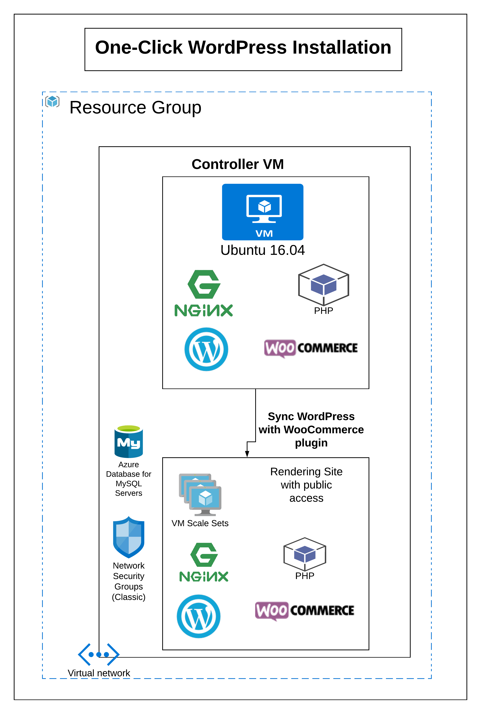

# Deploy and Manage a Scalable Moodle Cluster on Azure

This repo contains guides and [Azure Resource Manager](https://docs.microsoft.com/en-us/azure/azure-resource-manager/resource-group-overview) templates designed to help you deploy and manage a highly available and scalable
[WordPress](https://wordpress.com/) cluster on Azure. In addition, the repo contains other useful information relevant to running WordPress on Azure such as a listing of Azure-relevant WordPress plugins.

If you have Azure account you can deploy WordPress via the [Azure portal](https://portal.azure.com) using the button below. Please note that while you can use an [Azure free account](https://azure.microsoft.com/en-us/free/) to get started depending on which template configuration you choose you will likely be required to upgrade to a paid account.

## Fully configurable deployment

The following button will allow you to specify various configurations for your WordPress cluster deployment. The number of configuration options might be overwhelming, so some pre-defined/restricted deployment options for typical WordPress scenarios follow this.

  

NOTE:  All of the deployment options require you to provide a valid SSH protocol 2 (SSH-2) RSA public-private key pairs with a minimum length of 2048 bits. Other key formats such as ED25519 and ECDSA are not supported. If you are unfamiliar with SSH then you should read this [article](https://docs.microsoft.com/en-us/azure/virtual-machines/linux/mac-create-ssh-keys) which will explain how to generate a key using the Windows Subsystem for Linux (it's easy and takes only a few minutes).  If you are new to SSH, remember SSH is a key pair solution. What this means is you have a public key and a private key, and the one you will be using to deploy your template is the public key.

## Predefined deployment options

Below are a list of pre-defined/restricted deployment options based on typical deployment scenarios (i.e. dev/test, production etc.) All configurations are fixed and you just need to pass your SSH public key to the template for logging in to the deployed VMs. Please note that the actual cost will be bigger with potentially autoscaled VMs, backups and network cost.

| Deployment Type | Description | Launch | 
| --- | --- | --- | 
| Minimal  | This deployment will use NFS, MySQL, and smaller autoscale web frontend VM sku (1 core) that'll give faster deployment time (less than 30 minutes) and requires only 2 VM cores. Currently this will fit even in a free Azure trial subscription.|
| Small to Mid-Size | Supporting up to 1,000 concurrent users. This deployment will use NFS (with no high availability) and MySQL (8 vCores), without other options like Redis Cache.|
|Large size deployment (with high availability)| Supporting more than 2,000 concurrent users. This deployment will use Azure Files Premium, MySQL (16 vCores) and Redis Cache. |
| Maximum |This maximal deployment will use Azure Files Premium, MySQL with the highest SKU, Redis Cache, and pretty large storage sizes (for both data disks and DB).|

NOTE: Depending on the region you choose to deploy the stack in - the deployment might fail due to SKUs being hardcoded in the template where they are not available. For example, today our small-mid-size deployment option hard codes Gen-4 Azure MySQL SKUs into the template, and if a region where that is currently not available in (i.e. westus2) is used, your deployment will fail.  If your deployment fails, please revert to the fully configurable template where possible and change the SKU paramater to one that exists in your region (i.e. Gen-5) or alternatively change your deployment region to one in which the SKU is available (i.e. southcentralus).

## Stack Architecture

This template set deploys the following infrastructure core to your WordPress instance:

- Autoscaling web frontend layer (with nginx and PHP-FPM)
- Private Virtual Network for frontend instances
- Controller VM running cron and handling syslog for the autoscaling cluster
- [Azure Load balancer](https://azure.microsoft.com/en-us/services/load-balancer/) to balance across the autoscaling instances
- [Azure Database for MySQL](https://azure.microsoft.com/en-us/services/mysql/) or [Azure Database for PostgreSQL](https://azure.microsoft.com/en-us/services/postgresql/) or [Azure SQL Database](https://azure.microsoft.com/en-us/services/sql-database/)
- Dual [GlusterFS](https://www.gluster.org/) nodes or Azure Files or NFS for highly available access to WordPress files

The template also optionally installs plugins that allow WordPress to be integrated with select Azure services (see below for details).

## Useful WordPress plugins for integrating WordPress with Azure Services

WooCommerce plugin is integrated

-  WooCommerce is an open-source e-commerce plugin for WordPress. It is designed for small to large-sized online merchants using WordPress. WooCommerce is free and open source. WooCommerce inherits all of the strength and reliability of WordPress and uses it to build a world-class eCommerce experience for retailers and their customers.

## WordPress as a Managed Application
You can learn more about how you can offer WordPress as a Managed Application on the Azure Marketplace or on an IT Service Catalog (Link need to be updated) [here](https://github.com/Azure/Moodle/tree/master/managedApplication). This is a great read if you are offering WordPress hosting services today for your customers.

##  Observations about the current template < below links need to be updated>
The template is highly configurable, full details of the configuration options can be found in our [documentation](https://github.com/Azure/Moodle/tree/master/docs) (more specifically in our [parameters documentation](https://github.com/Azure/Moodle/blob/master/docs/Parameters.md)). The following sections describe observations about the template that you will likely want to review before deploying:

**Scalability** Out system is designed to be highly scalable, to achieve this we provide a Virtual Machine Scaleset for the web tier. This is already configured to scale on high load. However, scalaing the VMs is not instantaneous, therefore if you have a known hihg-load situation at a given time you should manually scale in preparation. This can be done through the Azure portal or the CLI. The database is less easily scaled at this point, but it is possible and documented in our [management documentation](https://github.com/Azure/Moodle/blob/master/docs/Manage.md#resizing-your-database).

**SSL** The template fully supports SSL but it is not possible for the template to manage this for you. More information in our [managing certs documentation](https://github.com/Azure/Moodle/blob/master/docs/SslCert.md).

**WordPress PHP Code** The WordPress PHP code is stored on the Controller VM and copied to each front end VM upon deployment and upon request (should you update the WordPress code with your own code). For more information see our [management documentation](https://github.com/Azure/Moodle/blob/master/docs/Manage.md#updating-moodle-codesettings).

**Database** Currently the best performance is achieved with [Azure Database for MySQL](https://azure.microsoft.com/en-us/services/mysql/) and [Azure SQL Database](https://azure.microsoft.com/en-us/services/sql-database/). With [Azure Database for PostgreSQL](https://azure.microsoft.com/en-us/services/postgresql/) we have hit database constraints which caused processes to load up on the frontends until they ran out of memory. It is possible some PostgreSQL tuning might help here.  At this stage Azure Database for MySQL and PostgreSQL do not support being moved to a vnet. As a workaround, we use a firewall-based IP restriction allow access only to the controller VM and VMSS load-balancer IPs.

**File Storage** There are two options for file storage - AzureFiles, Gluster FS and NFS. The Azure file shares support the industry standard SMB protocol, meaning you can seamlessly replace your on-premises file shares with Azure file shares without worrying about application compatibility. The Gluster FS solution is replicated thus provides highler availability, but incurs additional cost (2 x VMs) and some performance penalties (we are exploring ways to improve this and would welcome contributions from people who know WordPress and/or Gluster). NFS is highly performant and utilizes an existing VM in the cluster (so lower cost), but it is a single point of failure. At the time of writing there is no simple way to switch from one to the other depending on expected workloads and availability requirements, again this is something we would love to see resolved.

**Caching.** While enabling Redis cache can improve performance for a large Moodle site we have not seen it be very effective for small-to-medium size sites. We can likely improve upon this, patches welcome ;-)

**Regions.** Note that not all resources types (such as databases) may be available in your region. You should check the list of [Azure Products by Region](https://azure.microsoft.com/en-us/global-infrastructure/services/) to for local availability.

- If you have an immediate need for guidance for a larger sized deployment, you might want to share some details around your deployment on our [issues page](https://github.com/Azure/Moodle/issues) and we will do our best to respond. Please as much information about your deployment as possible such as:

  * average number of concurrent users your site will see
  * maximum level of concurrent/simultaenous users your site needs to support
  * whether or not HA is needed
  * any other attributes specific to your deployment (i.e. load balancing across regions etc.)

## Automated Testing (Travis CI)
This repository uses [Travis CI](https://travis-ci.org/) to deliver automated testing.

The following tests are carried out for every Pull Request and will also run in a Travis CI enabled forked repository:
* **JSON Linting** - All JSON files are linted to ensure they do not contain any syntax errors.
* **JSON Code Style** - All JSON files are tested to ensure they comply with project code style rules.

The following tests are carried out as part of the Pull Request merging prior to a contribution being accepted into the release branch:
* **Template Validation** - The template is subbmitted to Azure to ensure it is correclty formatted and contains valid logic.
* **Template Build** - The template is submitted to Azure and the stack described in the template is built to ensure a stack is correctly deployed.

### Setting Up Travis CI for Template Build
The following describes the process required if you want to run the template validation and build steps using your own Travis and Azure accounts.

To set up the build process, you will need:
* An Azure account or active subscription
* A fork of this repository linked to Travis CI
* Access to an installed instance of the Azure CLI
* A SSH keypair

The Travis CI process uses the *Azure CLI Service Principal* login method to authenticate against Azure. The documentation for logging in via a Service Principal can be found [here](https://docs.microsoft.com/en-us/cli/azure/authenticate-azure-cli?view=azure-cli-latest#logging-in-with-a-service-principal)

Before you can log in using the Service Principal process you need to create a *Service Principal*. The documentation to create a Service Principal login can be found [here](https://docs.microsoft.com/en-us/cli/azure/create-an-azure-service-principal-azure-cli?view=azure-cli-latest)

When a Service Principal is created using the Azure CLI a JSON response is returned containing:
* **name** - This is the Service Principal username.
* **password** - This is the Service Principal password.
* **tenantId** - This is the Service Principal tenant unique ID.

You will need these three above values to have Travis and Azure deploy and test your template.

The next step is to take the above values returned by the Service Principal creation and use them to define *environment variables* in Travis CI.

To set up per repository environment variables in Travis CI: [click here]( https://docs.travis-ci.com/user/environment-variables/#Defining-Variables-in-Repository-Settings) Using this documention set up the following three *hidden* environment variables in Travis CI for your fork of this repository.

* **SPNAME** - The value of the *name* parameter returned by the Service Principal create proccess.
* **SPPASSWORD** - The value of the *password* parameter returned by the Service Principal create proccess.
* **SPTENANT** - The value of the *tenant* parameter returned by the Service Principal create proccess.
* **SPSSHKEY** *(default: generate new)*- A public SSH key that you have the corresponding private key for. This is currently not used but is required for the build to be successful.
* **LOCATION** *(default: southcentralus)*- Location for the test resource group.
* **RESOURCEGROUP** *(default: azmdl-travis-XXX)*- Name to use for the resource group.
* **FULLCI_BRANCHES** *(default: master)*- Name of branches (separated by ':') to always run FULL CI (if credentials are provided). Full CI will run a deployment test which will create and use resources from your Azure account.

**NOTE:** You can trigger a full CI test by adding *[full ci]* or *[fullci]* anywhere in the commit message.  

**NOTE:** Make sure you set the environment variables to hidden otherwise they will be exposed publically at run time.

**NOTE:** As per the Travis CI documentation make sure you have correctly escaped the enviroment variable values when they are defined.

Once the environment variables are defined, Travis CI will run the template validate and build steps as part of the test process.

# Contributing

This project welcomes contributions and suggestions.  Most contributions require you to agree to a
Contributor License Agreement (CLA) declaring that you have the right to, and actually do, grant us
the rights to use your contribution. For details, visit [here]( https://cla.opensource.microsoft.com).

When you submit a pull request, a CLA bot will automatically determine whether you need to provide
a CLA and decorate the PR appropriately (e.g., status check, comment). Simply follow the instructions
provided by the bot. You will only need to do this once across all repos using our CLA.

This project has adopted the [Microsoft Open Source Code of Conduct](https://opensource.microsoft.com/codeofconduct/).
For more information see the [Code of Conduct FAQ](https://opensource.microsoft.com/codeofconduct/faq/) or
contact [opencode@microsoft.com](mailto:opencode@microsoft.com) with any additional questions or comments.

